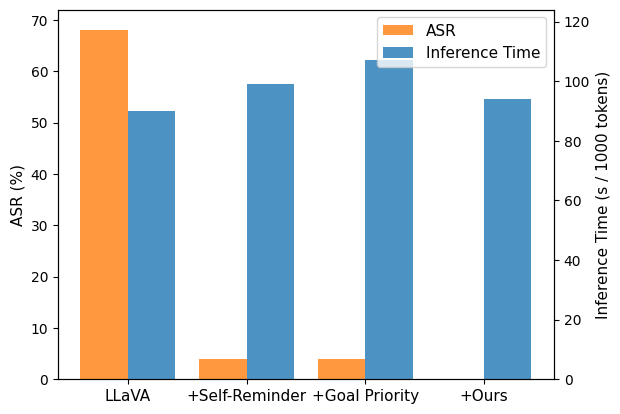

# InferAligner

<p align="center">
<a href='https://github.com/Jihuai-wpy/InferAligner/blob/main/LICENSE'>
</a> 
<a href='https://arxiv.org/abs/2401.11206'>
</a>

</p>

This is the official repository for [&#34;InferAligner: Inference-Time Alignment for Harmlessness through Cross-Model Guidance&#34;](https://arxiv.org/abs/2401.11206).

## Introduction

With the rapid development of large language models (LLMs), they are not only used as general-purpose AI assistants but are also customized through further fine-tuning to meet the requirements of different applications. A pivotal factor in the success of current LLMs is the alignment process. Current alignment methods, such as supervised fine-tuning (SFT) and reinforcement learning from human feedback (RLHF), focus on training-time alignment and are often complex and cumbersome to implement.  Therefore, we develop **InferAligner**, a novel inference-time alignment method that utilizes cross-model guidance for harmlessness alignment. InferAligner utilizes safety steering vectors extracted from safety-aligned model to modify the activations of the target model when responding to harmful inputs, thereby guiding the target model to provide harmless responses. Experimental results show that our method can be very effectively applied to **domain-specific models** in finance, medicine, and mathematics, as well as to **multimodal large language models (MLLMs)** such as LLaVA. **It significantly diminishes the Attack Success Rate (ASR) of both harmful instructions and jailbreak attacks, while maintaining almost unchanged performance in downstream tasks.**

<p align="center">
     <br>
    <br>
    Illustration of the inference process with and without InferAligner.
</p>

## Training-Time Alignment v.s. Inference-Time Alignment

<p align="center">
     <br>
    <br>
    Illustration of alignment methods.
</p>

The language modeling objective of LLMs, i.e., next token prediction, is not necessarily in line with human values. As a result, explicit alignment with human preferences becomes essential to make LLMs usable and reliable. In this paper, we categorize LLM alignment into training-time alignment and inference-time alignment.

Training-time alignment is typically performed by means of SFT, DPO, or RLHF. However, these methods involve a complex and cumbersome training process, requiring not only diverse and representative alignment datasets but also consuming significant training resources. Additionally, these methods also face the risk of alignment tax, often affecting the performance of downstream tasks while achieving alignment. These issues severely limit the exploration and application of training-time alignment methods in practical scenarios.

In contrast, inference-time alignment methods are simpler and easier to conduct without complex training process. During inference, methods such as adding alignment prompts in the input or shifting activations along the directions extracted from the target model itself are utilized to achieve model alignment. A recent work involves alignment through intervention in the decoding process. Specifically, it is achieved by guiding the model with a trained reward model to choose to generate tokens that yield higher rewards, thereby attaining alignment. Although easier to use, these methods have weaker alignment effects and often impact downstream capabilities of the target model. Many methods significantly increase inference time, affecting inference efficiency.

Therefore, we propose InferAligner, an effective inference-time alignment method that not only aligns target model effectively but also maintains almost unchanged performance in downstream tasks. Additionally, InferAligner hardly affect the inference time.

## InferAligner

InferAligner is a novel inference-time alignment method that employs cross-model guidance for harmlessness alignment. We directly leverage the conversation template and take the mean activation difference of the last token between harmful and harmless prompts as safety related vectors (SRVs). Specifically, we use the SRVs extracted from the models aligned for harmlessness as safety steering vectors (SSVs). During the inference stage of the target model, for each layer $l$, we supervise the intent of input instructions based on the SRVs and calculate the guidance gate $g_l$ to precisely control the activation shift. Then we shift the activations across all token positions using safety steering vectors $\theta_l$ extracted from aligned models and the guidance gate $g_l$.

The following is a schematic illustration of the computation for InferAligner. Please refer to our [paper](https://arxiv.org/abs/2401.11206) for more details.

<p align="center">
     <br>
    <br>
    Schematic illustration of the computation for InferAligner.
</p>

## Open-Source List

We will soon open-source our codes and datasets, stay tuned!

## Performance

### Main Results

InferAligner can significantly diminish the ASR of both harmful instructions and jailbreak attacks, while maintaining almost unchanged performance in downstream tasks.

<p align="center">
     <br>
    <br>
    Main results of the harmfulness evaluation and the utility evaluation.
</p>

### Results in LLaVA

InferAligner can be very effectively applied to LLaVA. In terms of inference time (inference speed), our method is almost unaffected due to no increase in context length.

<table style="width: 80%; margin: 0 auto">
  <tr>
    <td align="center">
        <br><em>LLaMA-7B</em>
      </td>
    <td align="center">
        <br><em>LLaMA-13B</em>
      </td>
  </tr>
</table>

### Scalability and Adaptability of InferAligner

InferAligner exhibits significant universality. In terms of scalability, InferAligner can be effectively applied to domain-specific models, regardless of whether they are fine-tuned based on LLaMA2-7B or LLaMA2-13B. Regarding adaptability, beyond the LLaMA2 series, InferAligner can also be effectively applied to the Qwen series and the InternLM series.

<table style="width: 80%; margin: 0 auto">
  <tr>
    <td align="center">
        <br><em>LLaMA2-7B</em>
      </td>
    <td align="center">
        <br><em>LLaMA2-13B</em>
      </td>
  </tr>
  <tr>
    <td align="center">
        <br><em>Qwen-7B</em>
      </td>
    <td align="center">
        <br><em>InternLM-7B</em>
      </td>
  </tr>
</table>

## Contribution

- We propose InferAligner, a novel inference-time alignment method that can effectively enhance the model's safety while maintaining unchanged downstream performance.
- InferAligner is simple to use and does not require training. It can also be effectively used even in the absence of aligned models.
- We are the first to explore the harmlessness alignment of MLLMs, and we present MM-Harmful Bench, the first multimodal dataset dedicated to safety research.

## Acknowledgements

- We sincerely thank Zhen Ye and Youqi Sun for their diligent help in constructing MM-Harmful Bench.
- We especially thank Wei Huang for his guidance and help in training our domain-specific model.

## Citation

If you find InferAligner useful for your research and applications, please cite using the Bibtex:

```
@misc{wang2024inferaligner,
      title={InferAligner: Inference-Time Alignment for Harmlessness through Cross-Model Guidance}, 
      author={Pengyu Wang and Dong Zhang and Linyang Li and Chenkun Tan and Xinghao Wang and Ke Ren and Botian Jiang and Xipeng Qiu},
      year={2024},
      eprint={2401.11206},
      archivePrefix={arXiv},
      primaryClass={cs.CL}
}
```
